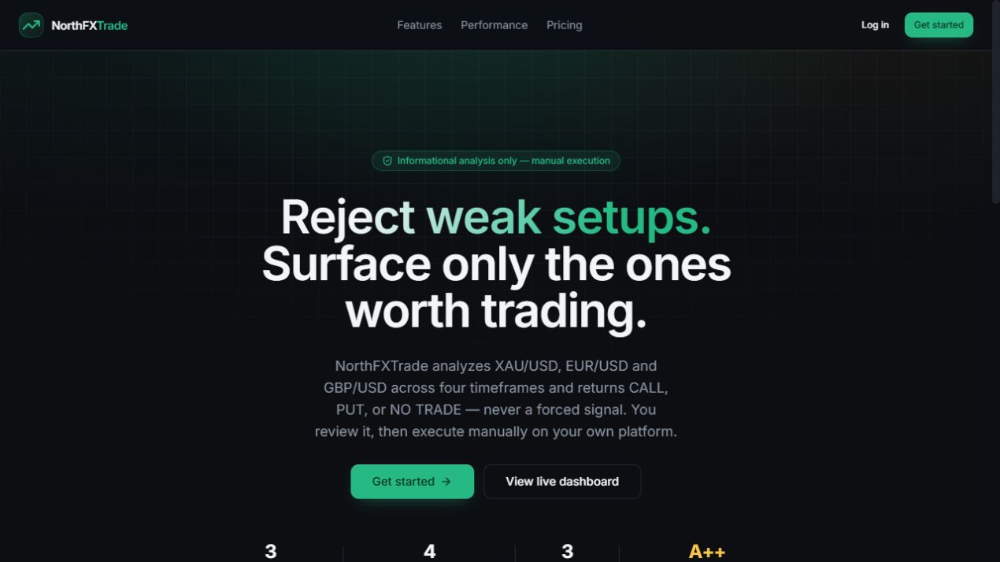
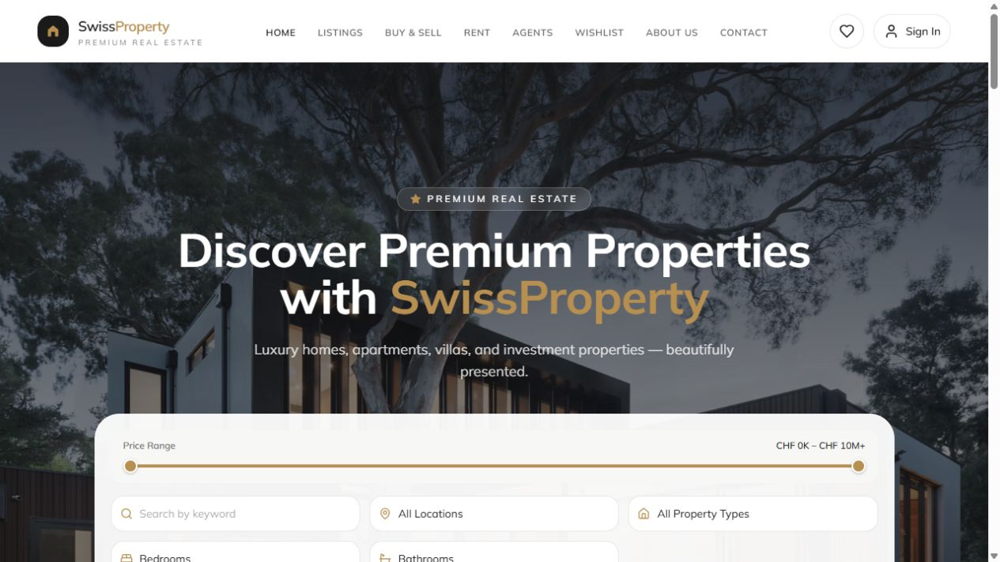
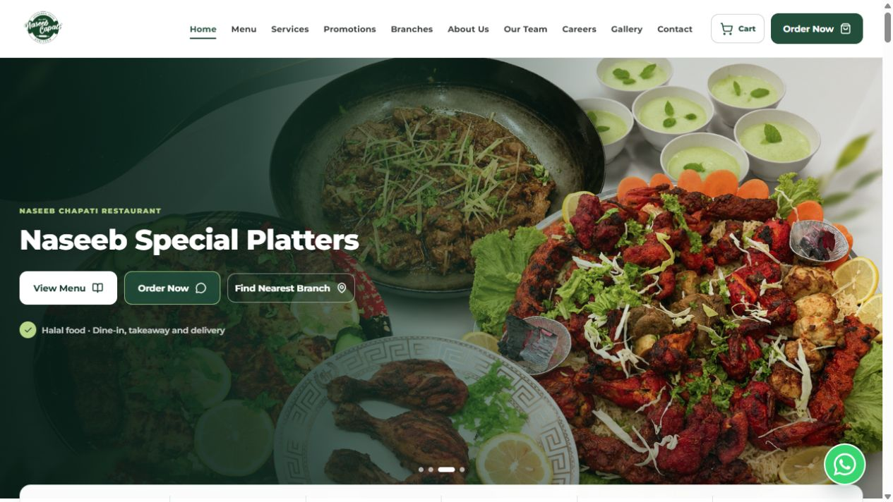

  

  <strong>Full-Stack Software Engineer · AI-Native Web Engineer · Product Builder</strong>

  I build scalable digital products from architecture to deployment—combining thoughtful product engineering with reliable full-stack execution across React, Next.js, TypeScript, Node.js, Supabase, PostgreSQL, and modern cloud infrastructure.

  
  
  
  

  

 

## Engineering identity

  

 

## Selected work

  Five selected public products that show how I approach product design, application architecture, secure data workflows, and polished delivery.

<table>
  <tr>
    <td colspan="2" valign="top">
      <table>
        <tr>
          <td width="50%" valign="middle">
            
          </td>
          <td width="50%" valign="middle">
            <h3 align="center">MyTNR · Flagship Community Platform</h3>
            
<strong>Digital community and organization management</strong>

            

              A production platform for Tehreek-e-Nojawanan Roundu supporting member registration, verification and approval, role-based administration, organizational leadership, opportunities, application workflows, notifications, directories, and reporting.
            

            

              <code>Next.js</code> <code>React</code> <code>Supabase</code> <code>Framer Motion</code> <code>Cloudinary</code>
            

            

              <a href="https://www.mytnr.org/"><strong>Live platform ↗</strong></a>
              &nbsp;·&nbsp;
              <a href="https://github.com/tnrorg/mytnrorg"><strong>Repository ↗</strong></a>
            

          </td>
        </tr>
      </table>
    </td>
  </tr>
  <tr>
    <td width="50%" valign="top">
      
      <h3 align="center">NorthFXTrade</h3>
      
<strong>Algorithmic market analysis platform</strong>

      

        A full-stack product codebase pairing a focused Next.js interface with Python and FastAPI services for market-data collection, multi-timeframe analysis, and manual decision support.
      

      

        <code>Next.js</code> <code>TypeScript</code> <code>Python</code> <code>FastAPI</code> <code>Supabase</code>
      

      

        <a href="https://northfxtradegb.vercel.app/"><strong>Live product ↗</strong></a>
        &nbsp;·&nbsp;
        <a href="https://github.com/shabbirdeveloper/RealTimeTradingAnalysisPlatform"><strong>Repository ↗</strong></a>
      

    </td>
    <td width="50%" valign="top">
      
      <h3 align="center">SHIA TALEEM</h3>
      
<strong>Multilingual learning and operations platform</strong>

      

        A role-based online learning platform with localized LTR/RTL experiences, Supabase authentication, PostgreSQL row-level security, protected operations, and learner-specific portals.
      

      

        <code>Next.js</code> <code>React</code> <code>TypeScript</code> <code>PostgreSQL</code> <code>Supabase</code>
      

      

        <a href="https://shiataleem4.vercel.app/en"><strong>Live product ↗</strong></a>
        &nbsp;·&nbsp;
        <a href="https://github.com/shabbirdeveloper/internationalquranlearningplatform"><strong>Repository ↗</strong></a>
      

    </td>
  </tr>
  <tr>
    <td width="50%" valign="top">
      
      <h3 align="center">SwissProperty</h3>
      
<strong>Premium property marketplace experience</strong>

      

        A polished React marketplace with URL-driven property discovery, advanced filters, saved listings, rich property galleries, responsive navigation, and an optional Supabase-backed data and admin layer.
      

      

        <code>React</code> <code>Vite</code> <code>Tailwind CSS</code> <code>React Router</code> <code>Supabase</code>
      

      

        <a href="https://swisproperty.vercel.app/"><strong>Live product ↗</strong></a>
        &nbsp;·&nbsp;
        <a href="https://github.com/shabbirdeveloper/Realesattemarketpalce"><strong>Repository ↗</strong></a>
      

    </td>
    <td width="50%" valign="top">
      
      <h3 align="center">Naseeb Chapati</h3>
      
<strong>Multi-branch restaurant and management platform</strong>

      

        A production restaurant platform combining a responsive customer experience with menus, ordering journeys, branch discovery, promotional content, and centralized data-driven management workflows.
      

      

        <code>React</code> <code>Vite</code> <code>Supabase</code> <code>Framer Motion</code> <code>Radix UI</code>
      

      

        <a href="https://www.naseebcapati.com/"><strong>Live product ↗</strong></a>
        &nbsp;·&nbsp;
        <a href="https://github.com/shabbirdeveloper/RestaurantplatformandManagementSystem"><strong>Repository ↗</strong></a>
      

    </td>
  </tr>
</table>

 

## Engineering stack

<table>
  <tr>
    <td width="50%" align="center" valign="top">
      <strong>Frontend &amp; product UI</strong>  
       
      React · Next.js · TypeScript · JavaScript · HTML5 · CSS3 · Tailwind CSS
    </td>
    <td width="50%" align="center" valign="top">
      <strong>Backend &amp; APIs</strong>  
       
      Node.js · REST APIs · FastAPI · Python · server-side architecture
    </td>
  </tr>
  <tr>
    <td width="50%" align="center" valign="top">
      <strong>Data &amp; platform</strong>  
       
      PostgreSQL · Supabase · MySQL · authentication · authorization
    </td>
    <td width="50%" align="center" valign="top">
      <strong>Delivery &amp; workflow</strong>  
       
      Git · GitHub · Vercel · Docker · VS Code · Postman · Figma
    </td>
  </tr>
</table>

 

## What I'm building

| | |
|:--|:--|
| **Currently building** | Production-ready SaaS, marketplace, and AI-native products |
| **Engineering focus** | Full-stack architecture, scalable APIs, secure data workflows, and modern web applications |
| **Working with** | React, Next.js, TypeScript, Node.js, Supabase, PostgreSQL, and Python |
| **Interested in** | AI-native product engineering and scalable digital platforms |

 

## Engineering highlights

<table>
  <tr>
    <td width="33%" valign="top">
      <strong>01 · End-to-end delivery</strong>  
      Product thinking from architecture and interface design through implementation, validation, and cloud deployment.
    </td>
    <td width="33%" valign="top">
      <strong>02 · Platform architecture</strong>  
      Multi-role applications, multilingual experiences, data-driven dashboards, API services, and real-time product workflows.
    </td>
    <td width="33%" valign="top">
      <strong>03 · Secure foundations</strong>  
      Authentication, authorization, PostgreSQL row-level security, protected operations, and maintainable application boundaries.
    </td>
  </tr>
</table>

 

## GitHub activity

  

<table>
  <tr>
    <td width="50%" align="center">
      
    </td>
    <td width="50%" align="center">
      
    </td>
  </tr>
</table>

  

Live public data—no contribution counts or achievement claims are hard-coded.

 

## Let's build something useful

<table>
  <tr>
    <td width="68%" valign="middle">
      <h3>Product engineering from idea to production.</h3>
      

        I'm open to conversations around full-stack products, SaaS platforms, marketplaces, AI-native web applications, and modernizing business software.
      

      

        <a href="https://www.northdigitaltech.com/"><strong>Portfolio ↗</strong></a>
        &nbsp;&nbsp;·&nbsp;&nbsp;
        <a href="https://www.linkedin.com/in/shabbir-hussain-88a959290/"><strong>LinkedIn ↗</strong></a>
        &nbsp;&nbsp;·&nbsp;&nbsp;
        <a href="mailto:northdigitaltech@gmail.com"><strong>Email ↗</strong></a>
        &nbsp;&nbsp;·&nbsp;&nbsp;
        <a href="https://github.com/shabbirdeveloper"><strong>GitHub ↗</strong></a>
      

      
Based in Malaysia · Building for clients and products worldwide

    </td>
    <td width="32%" align="center" valign="middle">
       
      <strong>Scan my portfolio</strong>
    </td>
  </tr>
</table>

 

  <strong>BUILD WITH PURPOSE · ENGINEER FOR SCALE</strong> 
  Shabbir Hussain · Full-Stack Software Engineer

