

  

  <strong>Full-Stack Software Engineer · AI-Native Web Engineer · Product Builder</strong>

  I build scalable digital products from architecture to deployment—combining thoughtful product engineering with reliable full-stack execution across React, Next.js, TypeScript, Node.js, Supabase, PostgreSQL, and modern cloud infrastructure.

  
  
  
  

  

 

## Engineering identity

  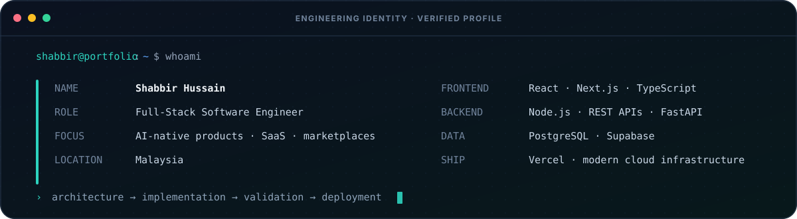

 

## Selected work

  Ten selected public products that show how I approach product design, application architecture, secure data workflows, and polished delivery.

<table>
  <tr>
    <td width="50%" valign="top">
      
      <h3 align="center">MyTNR</h3>
      
<strong>Digital community and organization management</strong>

      

        A production platform for Tehreek-e-Nojawanan Roundu supporting member registration, verification and approval, role-based administration, organizational leadership, opportunities, application workflows, notifications, directories, and reporting.
      

      

        <code>Next.js</code> <code>React</code> <code>Supabase</code> <code>Framer Motion</code> <code>Cloudinary</code>
      

      

        <a href="https://www.mytnr.org/"><strong>Live platform ↗</strong></a>
        &nbsp;·&nbsp;
        <a href="https://github.com/tnrorg/mytnrorg"><strong>Repository ↗</strong></a>
      

    </td>
    <td width="50%" valign="top">
      <a href="https://www.rego.services/">
        
      </a>
      <h3 align="center">REGO</h3>
      
<strong>Gilgit-Baltistan digital tourism marketplace</strong>

      

        A unified discovery and booking experience for hotels, tours, transport, guides, homestays, activities, and trusted local travel partners across Gilgit-Baltistan.
      

      

        <code>Next.js</code> <code>Tourism Marketplace</code> <code>Booking UX</code> <code>Search</code>
      

      

        <a href="https://www.rego.services/"><strong>Live marketplace ↗</strong></a>
      

    </td>
  </tr>
  <tr>
    <td width="50%" valign="top">
      <a href="https://northfxtradegb.vercel.app/">
        
      </a>
      <h3 align="center">NorthFXTrade</h3>
      
<strong>Algorithmic market analysis platform</strong>

      

        A full-stack product codebase pairing a focused Next.js interface with Python and FastAPI services for market-data collection, multi-timeframe analysis, and manual decision support.
      

      

        <code>Next.js</code> <code>TypeScript</code> <code>Python</code> <code>FastAPI</code> <code>Supabase</code>
      

      

        <a href="https://northfxtradegb.vercel.app/"><strong>Live product ↗</strong></a>
        &nbsp;·&nbsp;
        <a href="https://github.com/shabbirdeveloper/RealTimeTradingAnalysisPlatform"><strong>Repository ↗</strong></a>
      

    </td>
    <td width="50%" valign="top">
      <a href="https://swisproperty.vercel.app/">
        
      </a>
      <h3 align="center">SwissProperty</h3>
      
<strong>Premium property marketplace experience</strong>

      

        A polished React marketplace with URL-driven property discovery, advanced filters, saved listings, rich property galleries, responsive navigation, and an optional Supabase-backed data and admin layer.
      

      

        <code>React</code> <code>Vite</code> <code>Tailwind CSS</code> <code>React Router</code> <code>Supabase</code>
      

      

        <a href="https://swisproperty.vercel.app/"><strong>Live product ↗</strong></a>
        &nbsp;·&nbsp;
        <a href="https://github.com/shabbirdeveloper/Realesattemarketpalce"><strong>Repository ↗</strong></a>
      

    </td>
  </tr>
  <tr>
    <td width="50%" valign="top">
      <a href="https://www.naseebcapati.com/">
        
      </a>
      <h3 align="center">Naseeb Chapati</h3>
      
<strong>Multi-branch restaurant and management platform</strong>

      

        A production restaurant platform combining a responsive customer experience with menus, ordering journeys, branch discovery, promotional content, and centralized data-driven management workflows.
      

      

        <code>React</code> <code>Vite</code> <code>Supabase</code> <code>Framer Motion</code> <code>Radix UI</code>
      

      

        <a href="https://www.naseebcapati.com/"><strong>Live product ↗</strong></a>
        &nbsp;·&nbsp;
        <a href="https://github.com/shabbirdeveloper/RestaurantplatformandManagementSystem"><strong>Repository ↗</strong></a>
      

    </td>
    <td width="50%" valign="top">
      <a href="https://skardutravelplanner.com/">
        
      </a>
      <h3 align="center">Skardu Travel Planner</h3>
      
<strong>Northern Pakistan travel planning platform</strong>

      

        A destination-led travel experience for customized tours, hotels, transport, visa assistance, local guides, and trip planning across Skardu, Hunza, and Gilgit-Baltistan.
      

      

        <code>Tourism Platform</code> <code>Trip Planning</code> <code>Booking UX</code> <code>Responsive Web</code>
      

      

        <a href="https://skardutravelplanner.com/"><strong>Live platform ↗</strong></a>
      

    </td>
  </tr>
  <tr>
    <td width="50%" valign="top">
      <a href="https://www.restoranalkhalifa.com/">
        
      </a>
      <h3 align="center">Al Khalifa Signature</h3>
      
<strong>Premium Arabic restaurant experience</strong>

      

        A polished multilingual restaurant platform featuring authentic Arabic cuisine, digital menus, table reservations, event services, catering, galleries, and direct customer ordering journeys.
      

      

        <code>Next.js</code> <code>Restaurant Platform</code> <code>Reservations</code> <code>Multilingual UI</code>
      

      

        <a href="https://www.restoranalkhalifa.com/"><strong>Live website ↗</strong></a>
      

    </td>
    <td width="50%" valign="top">
      <a href="https://arifaoverseas.my/">
        
      </a>
      <h3 align="center">Arifa Overseas</h3>
      
<strong>Construction and workforce corporate platform</strong>

      

        A corporate web presence presenting construction, skilled manpower supply, maintenance services, project capabilities, careers, certifications, and company leadership across Malaysia.
      

      

        <code>Corporate Platform</code> <code>Construction</code> <code>Manpower Services</code> <code>Responsive Web</code>
      

      

        <a href="https://arifaoverseas.my/"><strong>Live website ↗</strong></a>
      

    </td>
  </tr>
  <tr>
    <td width="50%" valign="top">
      <a href="https://www.northdigitaltech.com/">
        
      </a>
      <h3 align="center">NorthDigital Tech</h3>
      
<strong>Official software house portfolio</strong>

      

        The official company portfolio for software, website, app, AI, e-commerce, SEO, and digital growth services—built around clear service discovery and project conversion journeys.
      

      

        <code>Next.js</code> <code>Software Portfolio</code> <code>Service Platform</code> <code>Responsive UI</code>
      

      

        <a href="https://www.northdigitaltech.com/"><strong>Official portfolio ↗</strong></a>
      

    </td>
    <td width="50%" valign="top">
      <a href="https://shiataleem4.vercel.app/en">
        
      </a>
      <h3 align="center">SHIA TALEEM</h3>
      
<strong>Multilingual learning and operations platform</strong>

      

        A role-based online learning platform with localized LTR/RTL experiences, Supabase authentication, PostgreSQL row-level security, protected operations, and learner-specific portals.
      

      

        <code>Next.js</code> <code>React</code> <code>TypeScript</code> <code>PostgreSQL</code> <code>Supabase</code>
      

      

        <a href="https://shiataleem4.vercel.app/en"><strong>Live product ↗</strong></a>
        &nbsp;·&nbsp;
        <a href="https://github.com/shabbirdeveloper/internationalquranlearningplatform"><strong>Repository ↗</strong></a>
      

    </td>
  </tr>
</table>

 

## Engineering stack

<table>
  <tr>
    <td width="50%" align="center" valign="top">
      <strong>Frontend &amp; product UI</strong>  
       
      React · Next.js · TypeScript · JavaScript · HTML5 · CSS3 · Tailwind CSS
    </td>
    <td width="50%" align="center" valign="top">
      <strong>Backend &amp; APIs</strong>  
       
      Node.js · REST APIs · FastAPI · Python · server-side architecture
    </td>
  </tr>
  <tr>
    <td width="50%" align="center" valign="top">
      <strong>Data &amp; platform</strong>  
       
      PostgreSQL · Supabase · MySQL · authentication · authorization
    </td>
    <td width="50%" align="center" valign="top">
      <strong>Delivery &amp; workflow</strong>  
       
      Git · GitHub · Vercel · Docker · VS Code · Postman · Figma
    </td>
  </tr>
</table>

 

## What I'm building

  

 

## Engineering highlights

  

 

## GitHub activity

  

  
  

  

Live public data—no contribution counts or achievement claims are hard-coded.

 

## Let's build something useful

<table>
  <tr>
    <td width="68%" valign="middle">
      <h3>Product engineering from idea to production.</h3>
      

        I'm open to conversations around full-stack products, SaaS platforms, marketplaces, AI-native web applications, and modernizing business software.
      

      

        
        &nbsp;
        
        &nbsp;
        
        &nbsp;
        
      

      
Based in Malaysia · Building for clients and products worldwide

    </td>
    <td width="32%" align="center" valign="middle">
       
      <strong>Scan my portfolio</strong>
    </td>
  </tr>
</table>

 

  <strong>BUILD WITH PURPOSE · ENGINEER FOR SCALE</strong> 
  Shabbir Hussain · Full-Stack Software Engineer

